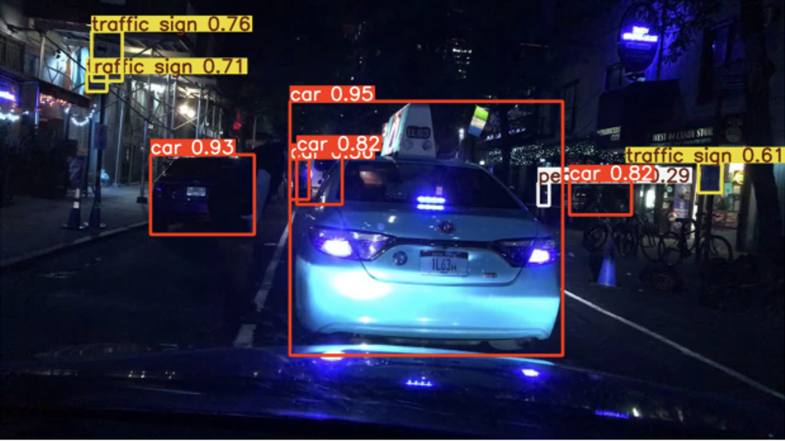

# Object-Detection

This project focuses on detecting three types of objects — **traffic signs**, **pedestrians**, and **vehicles** — using deep learning techniques. The dataset comprises `.jpg` images with annotations in JSON format, and the main objective is to train a model that can accurately detect and classify these objects.

## Dataset

- **Training Images:** 10,000
- **Test Images:** 1,990
- **Image Resolutions:** 1280x720 and 1280x960
- **Label Format:** JSON (in `train_data.json`)

### Data Preparation

- Removed all unlabeled images to avoid "empty scene" bias
- Splitted into:
  - **Training Set:** 7,702 images
  - **Validation Set:** 1,926 images

## Data Analysis

- Analyzed and visualized class distribution using Python scripts
- Verified bounding box placement and label correctness via sample visualizations
- Found some class imbalance in the dataset

## Data Augmentation

Applied the following transformations (each with 30% probability):

- Horizontal Flip
- Random Scale (±20%)
- Random Brightness/Contrast
- Rotation (±10°)
- Blur
- Gamma Adjustment

## Model

### Model Chosen: **YOLOv8m**

**Reasons for choosing YOLOv8m:**

- High accuracy with strong real-time detection
- Simple single-stage architecture
- Advanced backbone and head structure for better feature extraction

### Model Architecture

- **Backbone:** CNN for base feature extraction
- **Neck:** Combines features from different scales
- **Head:** Predicts bounding boxes and classes

### Training Details

- **Epochs:** 100  
- **Batch Size:** 32  
- **Learning Rate:** 0.001  
- **Optimizer:** Adam  
- **Losses:** `box_loss`, `cls_loss`, `dfl_loss`  
- **Metrics:** `Precision`, `Recall`, `mAP@0.5`, `mAP@0.5:0.95`

  
Loss Graphs

  
  
  

## Post-processing

- **Confidence Threshold:** 25%
- **Top Predictions Only:** Selected highest confidence boxes
- **Normalized Bounding Boxes:** Values scaled to [0, 1]
- **Submission-Ready Output:** Reformatted labels and coordinates

## Performance

- **Precision:** ~0.83  
- **Recall:** ~0.73  
- **F1 Score:** ~0.78  
- **mAP@0.5:** 0.5607

The model showed stable and balanced training with no overfitting or high variance.

## Output Samples

  
Screenshots Results

  
  
  

## Contributors

- [Okan BULGUR](https://github.com/okan-bulgur)
- [Burak EREN](https://github.com/lburakeren)
- [Yavuz SAYAR](https://github.com/yavuz-sayar)